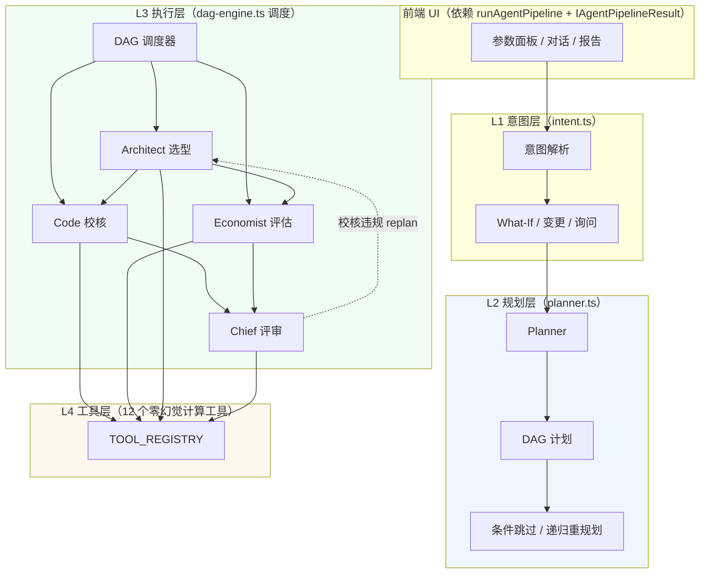
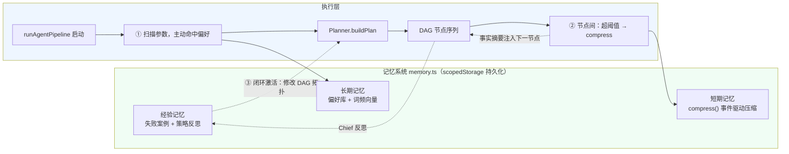
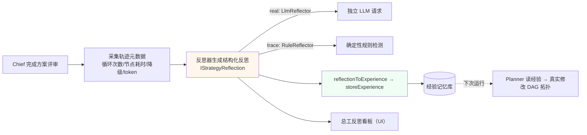

# 智构 StructMind · 建筑结构方案优化 AI 智能体

> 第一届「海之子杯」AI 智能体挑战赛 · 智能设计与方案优化赛道 · 参赛作品
> 面向建筑方案阶段的**多 Agent 协同**结构选型与优化工具，基于土木工程专业知识库智能生成多套候选方案并给出综合推荐。

## 🚀 在线 Demo

| 入口 | 地址 |
|---|---|
| **GitHub Pages（主站点，可公开访问）** | https://liuyux0512.github.io/-Structmind-agent/ |
| 妙搭平台（原部署环境） | https://4m2urftxnpjq0.aiforce.cloud/app/app_17ebqts8axz |

- 纯前端单页应用（SPA），手机/电脑浏览器均可直接打开，无需安装。
- GitHub Pages 由 `gh-pages` 分支自动发布，push 即更新。

## 🧠 项目定位

传统结构设计软件（PKPM、YJK 等）是**详细设计阶段的校核工具**；本作品聚焦**方案阶段的多目标快速寻优**——在结构概念设计环节，让工程师在几分钟内获得：

- 多套候选结构体系（框架 / 剪力墙 / 框架-剪力墙 / 钢结构…）的生成与横向比选；
- 基于现行国家规范（GB 55002、GB 50011 等）的逐条自动校核；
- 造价、工期、抗震、绿色低碳等多维度的量化对比；
- 综合加权推荐与风险提示（含置信度评估、触发重算条件）。

## 🏗️ 系统架构：多 Agent 协同管线



### 编排双模式（代际兼容）

`IEngineConfig.plannerMode` 控制编排方式，默认 `static`（保命默认值，行为与旧版完全一致）：

| 模式 | 编排方式 | 适用场景 |
|---|---|---|
| `static`（默认） | 旧硬编码四阶段顺序（`pipeline.runCore`） | 生产 / 对比基准 |
| `dynamic` | Planner 生成 DAG → `dag-engine` 调度执行 | 验证新引擎；模块②③接入记忆后动态化 |

两种模式在默认模板下输出**逐字段一致**（影子并行保证，见 `scripts/verify-dag.ts`）。

### 主动式记忆系统（模块②）

让 Agent「会思考、有记忆、能进化」——不是被动 RAG，而是主动注入、闭环激活。



**记忆如何影响决策**（三个真实代码路径）：

| 子系统 | 触发点 | 影响方式 | 可见化 |
|---|---|---|---|
| 短期记忆 | Agent 轨迹超 `compressThreshold`（默认 4000，UI 可调到 800 演示） | LLM（real）/规则（trace）提炼 3~5 条事实摘要，注入下一 Agent prompt | `[Memory] 检测到上下文过长，已自动压缩…` |
| 长期记忆 | 启动时 `scanPreferences(params)` | 词频向量余弦检索命中偏好 → 主动拼接「⚠️ 记忆提示」到 Architect 选型 prompt；运行结束自动提炼一句偏好存库 | `[Memory] 已注入历史偏好：…` |
| 经验记忆 | 启动时 `recallExperiences(ctx)` | 命中经验（`trigger` 纯函数）→ Planner 真实修改 DAG 拓扑（如 Architect 后插入抗震预校核节点） | `[Memory] 触发经验闭环：…` |

> 零重依赖：词频向量（1-gram + 2-gram）+ 余弦相似度存 localStorage，`IEmbedder` 接口保留，未来可无缝替换真 embedding RAG。

### 元认知与自我进化（模块③）

Chief 不仅评价**方案**，还评价 **Agent 团队的执行轨迹**——这是本次重构的灵魂。



**Agent 如何评价自己**：

| 环节 | 机制 | 双模式 |
|---|---|---|
| 轨迹评估 | 采集回退循环数、节点耗时、降级标记、token 估算、工具调用数 | 通用 |
| 结构化反思 | `IStrategyReflection{observation, diagnosis, lesson, applyTo, trigger}` | real: LLM 生成 JSON；trace: 规则检测（循环>0→预校核教训 / 节点>5s→优化 / 降级→查配置） |
| 闭环激活 | `applyTo=planner` 的教训 → `insert-precheck` 经验 → 下次 Planner 真实插入预校核节点 | 通用 |

### 设计要点

- **大模型只做"调度员/翻译官"**：意图解析、自然语言问答由 LLM 完成；**所有数值计算（内力估算、配筋率、挠度、碳排系数）由确定性规则引擎执行**，杜绝大模型幻觉导致的"拍脑袋算结构"。
- **规划与执行分离**：`planner.ts` 只输出计划拓扑（节点 + 依赖 + 条件），`pipeline.ts` 绑定执行器，`dag-engine.ts` 负责拓扑调度、条件跳过与递归重规划——替代旧版写死的四阶段顺序。
- **依赖图诚实**：DAG 重规划时动态重定向下游节点的 `deps`（`redirects`），杜绝读到废弃中间结果。
- **规范校核走硬逻辑**：抗震等级、位移角限值、耐火极限等判定基于结构化规则表（if-else 规则引擎），不依赖向量检索的模糊匹配。
- **完整推理轨迹可溯源**：`trace-engine.ts` 记录每个 Agent 的思考、判定依据、引用的规范条款与计算过程，界面以时间线形式呈现，评审可见"为什么是这个结论"。
- **反思 + 迭代回环**：总工评审会对推荐结果进行自我质疑（风险点、触发重算条件），体现真正的 Agent 决策回路而非一次性输出。

## ✨ 核心功能

1. **方案智能生成**：输入层数、面积、跨度、设防烈度、预算等参数，自动生成 3 套候选结构方案；
2. **规范自动校核**：抗震、耐火逐条判定（通过/警告/失败），附具体限值与实际值对照；
3. **七维综合比选**：造价、工期、抗震性能、施工难度、可持续、碳排放、综合评分雷达图对比；
4. **智能问答**：基于专业知识库的自然语言结构咨询；
5. **实时计算模式 / 大屏模式**：适配不同演示场景；
6. **运行时验证页**：内置评估集，一键跑通差异化场景验证管线正确性（`/verify` 路由）。

## 🛠️ 技术栈

- **前端**：React 19 + TypeScript + Vite 8（Rolldown）
- **样式**：Tailwind CSS v4 + shadcn/ui
- **可视化**：ECharts 6（雷达图/对比图）+ 自研 SVG 等轴测结构线框
- **动画**：Framer Motion
- **路由**：React Router v7
- **Agent 引擎**：自研 TypeScript 多 Agent 管线（意图 → 创作 → 校核 → 评估 → 总工评审）

## 💻 本地运行

```bash
# 前置要求：Node.js 20+
npm install

# 启动开发服务器
npm run dev:local
# 浏览器打开 http://localhost:5173

# 生产构建（本地验证）
npm run build:local

# GitHub Pages 部署构建（生成 dist/gh-pages/，push 到 gh-pages 分支即可发布）
node scripts/build-gh-pages.mjs
```

### 回归验证（九套，共 312 项断言）

```bash
npm run typecheck            # TypeScript 类型检查
npm run lint:eslint          # ESLint（仅 src）

npm run verify:norm          # 规范判定层（30 项）
npm run verify:domain        # 领域模型（22 项）
npm run verify:decision      # 决策裁定层（24 项）
npm run verify:counterfactual # 反事实推演（45 项）
npm run verify:dag           # DAG 引擎：static/dynamic 逐字段一致（15 项）
npm run verify:memory        # 记忆系统：压缩/偏好/经验闭环（23 项）
npm run verify:metacognition # 元认知：轨迹评估/反思/闭环改 DAG（12 项）
npm run verify:entry         # 真实模式管线（13 项）
npm run verify:agentic       # 专项：回退闭环/乱序/人类在环等（128 项）
```

> **平台说明**
> - `npm run dev` / `npm run build` 为妙搭平台专用命令（依赖 bash/rsync），本地请使用 `dev:local` / `build:local`（跨平台通用）。
> - 首次在 Windows 上 `npm install` 后若构建报缺 `rolldown` / `lightningcss` / `tailwindcss oxide` 平台二进制，执行：
>   `npm install @rolldown/binding-win32-x64-msvc lightningcss-win32-x64-msvc @tailwindcss/oxide-win32-x64-msvc`
> - AI 插件能力（`capabilityClient`）依赖妙搭平台环境；本地运行时演示模式可正常工作。

## 📁 目录结构

```
src/
├── agent/                # ★ 多 Agent 智能体核心（本作品创新点）
│   ├── dag-engine.ts     # DAG 执行引擎：拓扑调度/条件跳过/递归重规划（模块①）
│   ├── planner.ts        # Planner：生成 DAG 任务计划（规划/执行分离）
│   ├── memory.ts         # 主动式记忆系统：短期压缩/长期偏好/经验闭环（模块②）
│   ├── metacognition.ts  # 元认知：轨迹评估 + 结构化反思 + 闭环改 DAG（模块③）
│   ├── intent.ts         # 意图理解 Agent：参数解析/补全/模式识别
│   ├── pipeline.ts       # 管线入口：static（旧四阶段）/ dynamic（DAG）双模式
│   ├── real-engine.ts    # 真实模式推理引擎：function calling 循环
│   ├── trace-engine.ts   # 演示轨迹引擎：确定性脚本、全流程可溯源
│   ├── optimizer.ts      # 经济评估：造价/工期/碳排放多目标
│   ├── tools.ts          # Agent 工具库（12 个零幻觉计算工具）
│   ├── decision.ts       # 决策裁定层（强制性条文 > 锁定 > LLM > 评分兜底）
│   ├── scoring.ts        # 加权评分
│   ├── types.ts          # 领域类型定义
│   └── index.ts          # Agent 引擎入口
├── data/                 # ★ 领域数据与规则引擎
│   ├── code-rules.ts     # 规范规则层（声明式，可执行阈值）
│   ├── code-knowledge.ts # 规范知识库（规则层投影）
│   ├── norm-evaluator.ts # 规范求值器
│   ├── scheme-evaluator.ts # 方案评估器
│   ├── counterfactual.ts # 反事实推演引擎（what-if）
│   └── structure.ts      # 结构体系库与领域模型
├── pages/                # 页面
│   ├── HomePage/         # 主工作台（参数录入/方案生成/对比分析/智能问答）
│   ├── RuntimeVerify/    # Agent 管线运行时验证报告（/verify）
│   └── NotFoundPage/
├── components/           # UI 组件（含结构线框、Agent 时间线等）
├── hooks/                # 自定义 Hooks
└── lib/                  # 工具函数
```

## ⚠️ 免责声明

本工具的计算基于经验公式与简化假定，仅用于**方案前期概念比选与决策参考，不构成设计依据**。实际工程设计必须由注册结构工程师主持，采用专业结构分析软件（PKPM/YJK 等）按现行国家标准逐项复核。系统内置 Human-in-the-loop 理念：最终决策权始终在持证工程师手中，AI 仅提供量化建议。

## 📄 许可证

本仓库为参赛作品，保留所有权利。
