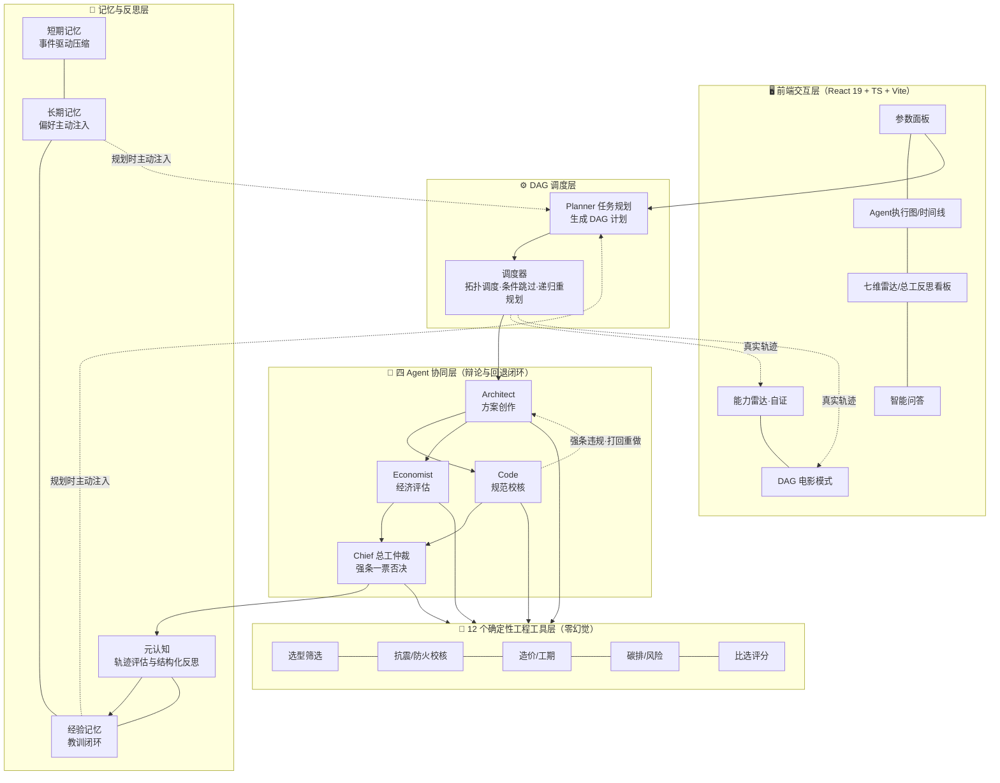

# 项目技术说明文档

**作品名称**：建筑结构智评 —— 建筑结构方案智能生成与多维度评估智能体（StructMind）

**作品简介**：面向结构工程师的多智能体协同设计助手。输入建筑参数后，四个智能体自动完成结构选型、规范校核、经济评估与综合推荐，具备动态规划、主动记忆与元认知自进化能力，让结构方案决策更科学高效。

**作品链接**：https://github.com/LiuYUX0512/-Structmind-agent

**团队名称**：智构团队

**团队成员**：刘宇翔（队长）、李国扬、吕勇宽、张盛涵

**提交日期**：2026年9月28日

---

## 1. 背景与场景

### 1.1 目标用户

- **设计院结构工程师 / 方案设计师**（25-45 岁）：处于方案比选阶段，需要在安全、造价、工期、碳排放等多目标间快速权衡，日常高频使用 PKPM/YJK 等专业软件，具备较强的专业能力但对重复性比选工作深恶痛绝。
- **高校土木工程专业师生**（教学场景）：需要一个能直观展示"选型逻辑 + 规范依据 + 量化对比"的工具辅助《工程结构设计》等课程教学。

### 1.2 用户痛点与问题定义

方案比选阶段需同时权衡造价、工期、碳排等多目标，**传统人工计算与 PKPM 逐方案试错周期极长**，具体表现为：

1. **选型靠经验**：现行十余种结构体系（框架、框剪、剪力墙、框筒……），方案期主要凭工程师个人印象筛选，容易漏掉更优体系；
2. **校核靠手查**：GB 55002《抗震通用规范》、GB/T 50011《建筑抗震设计标准》等强制性条文需逐条人工核对，层间位移角、剪重比、轴压比等指标计算繁琐且**漏检即合规风险**；
3. **比选难量化**：多方案在七维指标上互有优劣，缺乏统一量化口径，向甲方汇报时说服力不足。

**要解决的核心问题**：为方案前期提供一个"自动选型 + 强条校核 + 量化比选"的一站式智能助手，把工程师从重复计算中解放出来，聚焦真正的工程判断。

### 1.3 使用场景

**场景 A · 方案初期多目标快速寻优**：某 8 度设防、30 层住宅项目，设计师输入层数、跨度、设防烈度、预算等参数，系统 3 分钟内生成 3 套候选结构方案，附规范校核结论、七维雷达图与综合评分，直接支撑向甲方的首轮汇报。

**场景 B · 规范强条自动校核与打回重做**：候选的框架方案在 8 度区超出最大适用高度、层间位移角与剪重比不满足强条，Code Agent 逐条指出违规并附条文出处，自动打回 Architect 重新选型，Chief 总工仲裁后输出合规推荐——整个过程在执行图上以"打回重算"红色弧线可视化呈现。

### 1.4 价值体现

- **效率提升**：方案比选从"人工数天"压缩到"智能体数分钟"；
- **质量保障**：所有数值由确定性规则引擎计算（零幻觉），每条校核结论附规范条文出处，可追溯、可复核；
- **决策支撑**：七维量化对比 + 反事实推演（"如果把层数降到 20 层会怎样"），让方案讨论从"拍脑袋"变成"看数据"。

---

## 2. 功能说明

### 2.1 核心功能

| 功能 | 用户输入 | 处理方式 | 输出结果 | 解决的问题 |
|---|---|---|---|---|
| 方案智能生成 | 建筑类型/层数/跨度/烈度/预算 | Architect 调用选型工具从 12 类体系库筛选 | 3 套候选方案+适用性评述 | 选型不靠印象 |
| 规范自动校核 | 候选方案 | Code 调用校核工具逐条判定 | 每条 pass/warning/fail + 条文原文 | 强条不漏检 |
| 七维综合比选 | 权重偏好（可人工锁定） | Chief 调用比选工具加权评分 | 排序+雷达图+推荐理由 | 多目标难权衡 |
| 多智能体辩论 | —（自动触发） | Code 挑刺→Architect 重做→Chief 仲裁 | 合规的最终推荐 | 违规方案自动纠错 |
| 反事实推演 | "层数降到 20 层会怎样" | 反事实引擎双快照对比 | 逐指标差异+规范翻转 | 方案讨论凭直觉 |
| 人类在环 | 锁定方案/预算上限/强制权重 | 硬约束优先于 LLM 裁定 | 干预记录可见 | 工程师保持决策权 |
| 能力自证雷达 | —（自动生成） | 六维指标全部绑定本次运行真实日志 | 六边形雷达 + 悬停溯源 | AI 能力"说不清" |
| DAG 电影模式 | 点击"15 秒看懂" | 执行轨迹回放成 15 秒叙事 | 全屏电影 + 字幕/进度条 | 流程难以一眼看懂 |

### 2.2 技术方案

本项目为**纯自主开发**的完整多智能体系统（未基于扣子/Dify 等平台搭建），三项核心技术壁垒：

**壁垒一：规划与执行分离——动态 DAG 编排引擎**
我们不是"写死的流水线"。Planner 生成依赖显式化的 **DAG 任务计划**，调度器按拓扑序执行，支持条件跳过与**递归重规划**：Code 发现规范违规时返回 replan 指令，动态插入"方案重出+复核"新节点，下游依赖自动重定向，杜绝读到废弃中间结果。提供 `static/dynamic` 双编排模式，新旧引擎影子并行、逐字段等价，可一键切换对比验证。

**壁垒二：多智能体辩论机制**
Code Agent 逐条挑刺 → Architect 携校核反馈重出方案 → Code 复核 → Chief 总工终审仲裁。**强制性条文拥有一票否决权**：裁定优先级为"强制性条文 > 工程师锁定 > LLM 裁定 > 评分兜底"，LLM 的推荐若触碰强条会被代码层直接否决并在日志中留下条文级证据。

**壁垒三：零幻觉计算引擎**
**大模型只做调度与表达，不做任何数值计算**。全部数值由 12 个硬编码工程工具产出：规范限值表（位移角/剪重比/轴压比/高宽比）、GB/T 50011 反应谱曲线、底部剪力法、造价工期碳排估算模型等。每条结论附带完整计算链（输入→公式→结果）与条文出处。

**支撑能力：记忆与元认知系统**
- 短期记忆：Agent 轨迹超阈值（可配置，演示可调至 800）事件驱动压缩为事实摘要注入下一环节；
- 长期记忆：启动时主动扫描参数，词频向量检索命中历史偏好即注入规划提示；运行结束自动提炼偏好存库；
- 元认知：Chief 评价执行轨迹（循环次数/节点耗时/降级/token），生成结构化反思写入经验库，**下次运行真实修改 DAG 拓扑**（如自动插入抗震预校核节点）。

**支撑能力：可解释可视化层（自证式 UI）**
系统不仅"会算"，还能把"自己怎么算的"讲清楚——这是本项目在演示性上的关键设计：

- **能力雷达（CapabilityRadar）**：六边形雷达，六个维度（动态规划 / 主动记忆 / 元认知反思 / 硬计算密度 / 多 Agent 协同 / 可解释轨迹）的**分值全部绑定本次运行的真实指标**，而非写死的满分装饰。悬停任一顶点弹出"分子/分母 + 数据来源"（例如"硬计算密度 34/50 —— 34 条日志为确定性工具调用"），并支持点击跳转到对应证据源。其中"硬计算密度"直接量化零幻觉红线的执行程度（工具调用数 / 总日志数）。
- **DAG 电影模式（DagMovieMode）**：点击"15 秒看懂"，把整条执行轨迹回放为一段全屏叙事——节点依次点亮、打回弧线出现、总工仲裁收束，配同步字幕、章节进度条与键盘导航。提供**双模式**：`📽️ 真实回放`（从 actionLog 提取镜头，可复现任意一次真实运行）与 `🎬 高光演示`（预置最佳案例），标签明示来源，不混淆演示与真实。
- **Agent 执行图（AgentFlowMap）**：节点四态着色（待执行灰 / 执行中脉冲 / 成功绿 / 失败红），连线标签**动态提取真实语义**（如"发现 3 条强条违规：层间位移角、剪重比…"、"传递 3 个候选方案"），而非静态箭头。点击任一节点展开**证据链面板**：token 用量与耗时以大字量化呈现，下挂该节点的完整思考、工具调用与原始返回。
- **一镜到底的示例首屏**：首次打开即加载"8 度设防 50 层智能办公楼"的完整高亮案例轨迹（含 8 次迭代、多轮打回），无需用户操作即可看到最丰富的能力展示，并明确标注"当前展示：示例项目"。

**技术栈**：React 19 + TypeScript + Vite 8 前端；自研多智能体引擎（纯手写 TS，零重依赖）；DeepSeek API（function calling）；演示模式全程离线可跑。

**设计系统**：为达到"顶级作品"的视觉一致性，项目沉淀了一套完整设计系统——5 色语义色板（primary `#0F4C81` / teal `#12A5B5` / amber `#E8930C` / success / destructive/warning）、5 级字体层级（display / title / body / caption / hero-number）、8pt 语义间距（element / card / section）、玻璃拟态卡片（`backdrop-filter: blur(20px) saturate(130%)`）。同时完整支持 `prefers-reduced-motion` 无障碍降级、`@media print` 打印导出，以及大屏演示模式。

### 2.3 功能架构图

### 2.4 创新与差异化

1. **动态 DAG 与递归重规划**：任务计划是"活的"——校核违规即图上的回退边，系统自己改自己的执行计划，并以可视化执行图呈现给用户；
2. **主动注入的长期记忆与经验闭环**：记忆不是"被动查询的日志"，而是启动时主动注入规划、运行后自动沉淀、下次真实改变 DAG 拓扑的进化闭环；
3. **人类在环（HITL）与零幻觉计算引擎**：工程师可锁定方案、设定预算上限、强制权重，硬约束优先级高于模型裁定；配合"大模型只调度、规则引擎管数值"的零幻觉红线，兼顾智能与工程可信；
4. **自证式 UI——能力不靠宣称，靠指标**：能力雷达的每个维度都能点开看到"分子/分母与数据来源"，电影模式明示"真实回放 / 高光演示"，把"我们有多强"这件事变成可验证的工程事实而非宣传语。

### 2.5 作品完成度

- **已完成**：四 Agent 协同管线、DAG 引擎、记忆系统、元认知、反事实推演、人类在环、报告导出、七套可视化看板、能力雷达与 DAG 电影模式、完整设计系统与无障碍适配；**9 套共 312 项回归测试全部通过**，生产构建稳定，演示模式全程离线可跑；
- **不足**：真实推理模式需配置大模型 API Key；反事实推演的滑杆式交互正在开发中；成本瀑布图因当前数据为单值未强行可视化（不做无意义装饰）；
- **后续规划**：① LLM 驱动的自主规划深化（自然语言直接生成任务 DAG）；② 经验记忆的跨项目泛化；③ 对接 PKPM/YJK 计算结果的复核闭环。

---

## 3. 演示示例

### 3.1 访问方式

- **在线 Demo**：（已上线的访问地址）
- **本地运行**：`npm install && npm run dev`（演示模式无需任何 Key，全程离线可跑；真实模式在配置面板填入 DeepSeek API Key 即可）
- **建议测试问题**：
  1. "8 度设防、30 层的框架结构是否合规？"
  2. "如果把层数从 30 降到 20 层会怎样？"
  3. "剪力墙换成框剪会怎么样？"

### 3.2 案例展示

以 8 度设防、30 层框架为例：系统自动筛选出框架/框剪/剪力墙三套候选 → 校核发现框架**层间位移角、剪重比、最大适用高度三项强条不满足** → 执行图出现红色"打回重算"弧线，Architect 带反馈重出 → Chief 仲裁推荐剪力墙方案 → 输出七维雷达图与总工反思（置信度自评 + 风险热力图 + 策略反思）。

**七维比选口径**（`METRIC_DIMENSIONS`）：造价（元/㎡）、工期（月）、抗震性能（分）、施工难度（分）、可持续性（分）、装配率（%）、碳排放（kgCO₂/㎡）。其中造价/工期/施工难度/碳排放为逆向指标（越低越优），其余为正向指标。

**首屏示例项目**：首次打开默认加载"8 度设防 50 层智能办公楼"完整轨迹，可直接观看能力雷达满值形态与 15 秒电影模式全流程回放。全流程截图见演示视频与仓库 README。

---

## 4. 团队分工

| 成员 | 角色 | 主要职责与贡献 |
|---|---|---|
| **刘宇翔（队长）** | 总体设计与技术负责人 | 项目总体规划与需求定义；主导多智能体架构设计与技术方案制定（DAG 编排、辩论回退、记忆/元认知三层设计）；负责 AI 协同调度与提示词工程（任务拆解、多 AI 工具转接与结果整合）；对规范条文的工程语义做最终校验；主持全量回归验证与生产构建把关（312 项）；视觉设计系统定调与自证式 UI 方案设计；竞赛材料统筹与答辩 |
| **李国扬** | 知识库与测试 | 负责规范知识库的资料收集与整理（GB 55002/55037、GB/T 50011 等条文收集与清单化录入）；设计多组工程参数组合的功能测试场景，记录并反馈问题；参与比选指标工程合理性的讨论校验 |
| **吕勇宽** | 体验与演示素材 | 负责 UI/UX 视觉走查与交互体验反馈（界面布局、操作流畅度）；整理典型演示案例的工程参数；辅助功能测试与问题记录 |
| **张盛涵** | 视频与文档 | 负责核心功能演示视频的录制与剪辑；竞赛文档材料的校对与排版；测试问题记录与回归验证辅助 |

> 工作模式说明：团队采用"人机协同"开发模式——成员负责需求定义、领域知识校验、架构决策与最终验证把关；AI 工具（代码生成、文档初稿）在各环节深度辅助。每一次 AI 产出均经过人工逻辑校验与全量回归测试后方才合入。
